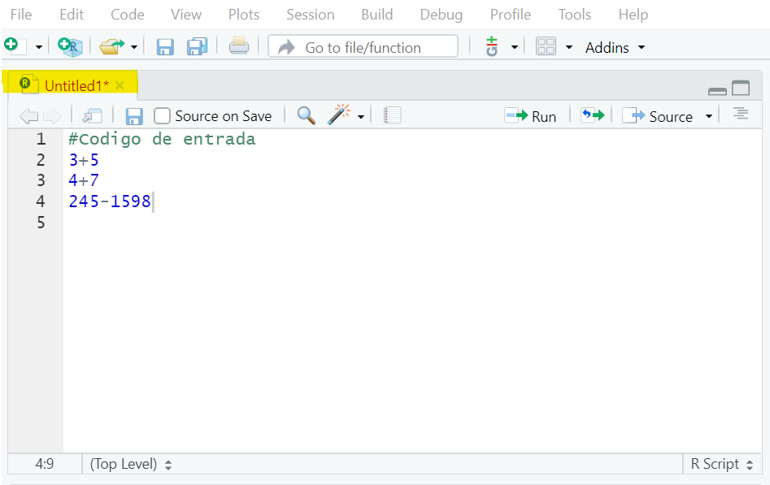

# Primeros cálculos en R {#intro}

La idea es familiarizarse con el entorno de **R** y definirlo como lo que es, una "calculadora". Es por esto que una forma de hacer cálculos con la base instrumental que trae el programa, se presenta a continuación.

```{example, label="Pr1", name="Operaciones básicas"}
Si intentamos sumar un par de números enteros es facíl tener:
```

```{r echo=TRUE}
  3+5 #Una suma o adición
```

Note que el resultado es similar a cualquier calculadora. Para esta parte, es de notar que aparece el número $[1]$ y luego sí la respuesta. Ese valor hace referencia al orden del dato dentro de los elementos del programa^[Dentro de la gran mayoría de los cálculos simples o sencillos, saldrá ese número siempre acompañando cada resultado.].

Si por otro lado se quiere el producto de 1255 con la (raíz cuadrada) de 25 o mejor escrito como $1255 \times \sqrt{25}$, entonces debe ser establecido de tal forma que

```{r}
1255*sqrt(25) #Producto con la raíz cuadrada de 25
```

Si se desea obtener una seguidilla de cálculos ya toca escribirlos -*como si fuera una lista*- e implementarlos directamente, ya es:

```{r eval=FALSE} 
  13**2 #Potencia de un número
  300/25 #Simple división entre 300 y 25
  450+320+112 #Suma de tres números enteros
  sqrt(12) #La raíz cuadrada del número 12
```

Todas las operaciones que se deseen realizar en **R** que involucran operaciones matemáticas, pueden ser escritos directamente y obtendremos los resultados deseados.

Note que el operador (#) es para decirle al programa que no ejecute lo que se encuentra después de él, se usa para tomar notas o escribir algo al respecto en los archivos **script** de **R**, por ejemplo:

```{R }
#Soy carlos yanes
```

## Script o archivo tipo bitacora {#bit}

Los **script** son archivos que comunmente se desarrollan en formato de _texto_ o de _bloc de notas_. Constituye la forma de llevar y controlar los codigos que se van a implementar los cálculos y se referencian como bitacoras o diario, en el cuál se trabaja. Regularmente vienen instalados en el programa de **R** en un formato clásico o si ya se hace uso de [R Studio](https://rstudio.com/products/rstudio/download/) que es un potente aliado^[Para mayor información consulte la pagina web o enlace de **R Studio**.] en el entorno de ejecución del programa **R**, se le denomina IDE^[Por sus siglas en ingles significa _Integrated Drive Electronics_, no es mas que un entorno de desarrollo interactivo que facilita interactuar mejor y de manera mas "amigable" con todos los asuntos de los lenguajes de programación].

Abrir un archivo tipo **script** en **R Studio** es sencillo, solo hay que ir al panel superior izquierdo del programa y debajo de la pestaña de File se encuentra el logo (+) y al dar _click_ se le desplegará la lista de opciones y en el, es solo volver a dar _click_ donde dice **R Script**, una forma mas rápida con el teclado es con las teclas `Ctrl+Shift+N`.  

```{r rmarkdown1, echo=FALSE, out.width='75%', fig.align='center'}

```
Al crear un **script** en **R Studio**, podrá desarrollar y escribir los códigos con el cual va realizar su trabajo, mire lo siguiente:

```{r rmarkdown2, echo=FALSE, out.width='75%', fig.align='center'}

```

## Otras operaciones y cálculos

En economía y en muchas ciencias sociales se hace uso extensivo de las **matemáticas** y de la **estadística**. Muchas veces será incluso necesario calcular o realizar algunas transformaciones en las variables para poder tener unas métricas mas informativas como son los _logaritmos_, _valores absolutos_, valores de forma _exponencial_ o de notación científica, entre otros. Algunos comandos que se pueden usar en **R** para eso son:

| Operación     | Resultado     |
| ------------- | ------------- |
| Valor absoluto| abs()         |
| Logaritmo     | log()         |
| Logaritmo base| log(,)        |
| Exponencial   | exp()         |
| Factorial     | factorial()   |
| Raíz cuadrada | sqrt()        |

```{example, label="Pr2", name="Valor absoluto"}
Calcule el valor absoluto del número (-3), esto simplemente es:
```

```{r echo=TRUE}
  abs(-3) # Es el valor absoluto de (-3)
```
Sin embargo, en una operación conjunta, si se posee una lista de elementos o un **vector** de elementos^[Estos deben ir separados por (,) y colocando de ante sala la letra (c) que hace referencia a _columnas_ en el programa **R** ], es mucho mas simple implementarlo de tal forma que:

```{r echo=TRUE}
  x<-c(-3,-5,3,11,-16,18,21,-31,-33) # Lista de valores
  abs(x)
```
De igual forma, funciona con un *logaritmo* o también una operación que involucre una de forma de notación científica o *exponencial*, esto puede notarse así:

```{example, label="Pr3", name="Cálculo de logaritmo natural"}
Obtener el logaritmo de una lista de elementos de una lista o vector que denominaremos (y)
```

```{r echo=TRUE}
  y<-c(15,21,23,29,16,28,32,45,33) # Lista de valores para vector Y
  log(y) #Se calcula el logaritmo de cada uno de los elementos
```

Observe que el **Programa** calcula el logaritmo natural de cada uno de los elementos del vector (y). Para la forma *exponencial*, es de uso de la notación del logaritmo base (e) y que muchos conocen como la expresión de **Euler**, e.g: $e^{x}$, recuerde ademas que si este lo usamos de tal manera que $Y=ln(e^{x})=x$. Esto puede ser escrito como:

```{r echo=TRUE}
  x<-150 
  exp(x) # En R exp hace referencia a la formula de (e)
```

## Funciones en R

Muchas veces, se hace necesario crear nuestras propias formulas y/o funciones. Para esto, se debe utilizar por lo menos, tres ingredientes de una **función**. Estos son:

1. Argumento
2. Operación 
3. Valor

Del *Argumento* salen los componentes principales que van a involucrarse dentro del comando. La parte de *Operación* es la formula (matemática o estadística) y por último el *Valor* que será el resultado de la **función**.

```{r, echo=TRUE, results='hide'}
mi_formula<- function(argumento) {
  operación
  return(valor)
}
```
Observe que los tres _ingredientes_ aparecen en la forma del código, como la manera de implementarlo. - _No puede olvidar usar los elementos de function, return y los respectivos corchetes_ -

```{example, label="Pr4", name="Estructura de una función"}
Tome a consideración que le solicitan la sumatoria de un grupo de valores.Es sencillo obtener en **R** cuando uno tiene una expresión como:
```
\begin{equation*}
\sum \limits_{i=1}^{n} X_{i} \quad \text{donde i}\; \in \; \left \{1,2,3,\dots,n \right\}
\end{equation*}

Que viene a ser la suma de los elementos de la variable X. Tome por ejemplo que X sean las _ventas_ de una empresa en ciertos periodos de tiempo y sus valores correspondientes son: $\{350, 690,1120, 990 \}$. Le solicitan calcular la suma de todas ellas.

\begin{equation*}
350+690+1120+990
\end{equation*}

El comando de **sum** (contiene la función de suma o sumatoria) y permite calcular esa parte de forma inmediata.

```{r echo=T, eval=TRUE}
x=c(350,690,1120,990)
sum(x)
```

Digamos ahora que se requiere tener la formula del cubo o polinomio de tercer orden, la función que permitiría eso, sería:

```{r, echo=TRUE}
cubo<- function(x){  # Se le da nombre a la función (argumento)
  x^3                # Se aplica la (operación)
}
cubo(990)  #Probamos el resultado
```

Obteniendo el resultado ideal del cubo de uno de los datos anteriores.-_Igual puede usarse con cualquier valor o lista de elementos_ -. En otras consideraciones, algunas veces hay formulas un poco mas _complejas_ de usar. Tome ahora lo siguiente:

\begin{equation*}
\prod \limits_{i=2}^{4} (3i-2)
\end{equation*}

Ya no se involucra la **sumatoria** si no la **productoria**. Esta última, no suma los elementos si no que los múltiplica^[La expresión de productoria sirve para simplificar una gran cantidad de multiplicaciones de elementos. Si usted tiene $\prod \limits_{i=1}^{n} x_{i}$, esto le indica multiplicar cada valor del vector desde el primer elemento hasta el último, empezando desde el número que le diga el subíndice hasta el del superíndice que será el límite superior.]. Mire que de forma _manual_, la anterior expresión nos brinda como resultado lo siguiente:

\begin{equation*}
(3)(2)-2\times(3)(3)-2\times(3)(4)-2=280
\end{equation*}

Donde la operación se **repite**, empezando desde el valor de 2, pasa por 3, sigue aumentando hasta el valor de 4, respectivamente. Ya haciendo uso de una función cuyo nombre le daremos (pro), el código a implementar para ajustar todo es

```{r, echo=TRUE}
pro<-function(x,y){a=3*(x:y)-2;m=prod(a);m}
#Argumentos X y Y son donde empieza y termina la productoria.
pro(2,4)
```

En la anterior, la formula se subdivide en varias partes dentro de la _operación_, ya que primero hay que decirle que dentro de los límites de los valores del argumento. Hay que hacer la operación continua del calculo de cada uno de los valores que hacen parte del vector asociado. _Dicho en otras palabras, tener presente los límites, desde donde va hasta donde términa_. Imaginese si el límite fuera mayor, es decir, que la operación se hiciera desde 3 hasta 15.

```{r, echo=TRUE}
pro(3,15)
```

La cifra obtenida nos da en _notación científica_ o valores extremadamente grandes, con eso, ya nos ahorramos mucho tiempo y una gran cantidad de notación, mas o menos eso sería:

\begin{equation*}
(3)(3)-2\times(3)(4)-2\times(3)(5)-2\times(3)(6)-2\times \cdots \times(3)(15)-2=2.8576e+17
\end{equation*}

La función realiza los cálculos de forma que el codigo permite simplificar _-objetivo de la ciencia-_ enorme cantidad de cálculos y conseguir el resultado en el menor tiempo posible.


