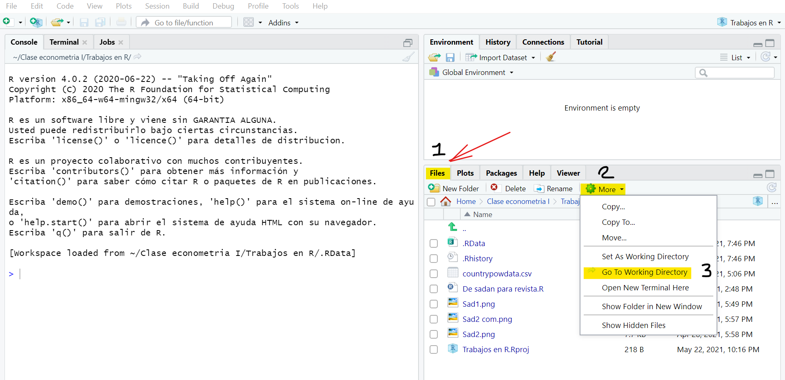

# Datos

Una de las cosas mas importantes que debe hacer todo economista al hacer uso de **R**, es importar las **bases de datos** con las que pretende trabajar y armar su *proyecto*. Los datos vienen desde distintos formatos y poseen varias clasificaciones, recordemos unos conceptos claves para avanzar

- **Base de datos**: Es una colección especifica de datos.
- Que posee un **formato** ``popular'', es decir, es una tabla (matrices)
- También es de forma *rectangular* cuya organización aborda **filas** y **columnas**.
- Una **fila** tiene datos de una o varias *variables* para un mismo **individuo**.
- Una **columna** contiene valores de una *variable* para muchos individuos.

Por otro lado, podemos tener <span style="color:blue"> datos </span> de los siguientes tipos:

- <span style="color:red">Índices</span>: Es la parte de nombres, números de identificación o cuestionario en una base de datos.
- <span style="color:red">Binarios</span>: Variables que tienen sólo dos posibles respuestas. Ej: Si, no; Femenino, masculino, etc. Se codifican con (0 y 1), y se les conoce como variable *dummy*.
- <span style="color:red">De conteo</span>: Números enteros de no negación.
- <span style="color:red">Continuos</span>: Aquellos que admiten decimales.
- <span style="color:red">Nominales</span>: Respuestas no ordenadas y que amplían el espectro de las variables binarias, suelen ser datos categóricos. 
- <span style="color:red">Ordinales</span>: Admiten respuestas nominales pero en esencia *ordenadas* y son codificadas con números.


## Estructuras de datos usualmente utilizadas en econometría

En economía regularmente se trabaja con tres tipos de bases de datos conocidos como **Corte Transversal**, **Series de Tiempo** y **Paneles longitudinales**.

### Datos de corte transversal

Son aquellas *bases* que regularmente tienen información en un solo periodo de tiempo y que varían por individuos, instituciones, países o empresas. Se denotan sus observaciones con el subíndice (i), por ejemplo: $X_{i}$. Donde $X$ hace referencia a cada una de las variables como el nombre, la edad, los ingresos, etc.  

```{r, echo=FALSE, warning=FALSE, fig.cap="Datos de Corte transversal. Fuente: Elaboración del Autor"}
library(flextable)
library(magrittr)
library(charlatan)


set.seed(123) # semilla de uso

n <- 7
ctbase <- data.frame(
  Nombre = ch_name(n = n, locale = NULL),
  Grado = as.Date(as.POSIXct(unlist(ch_date_time(n = n)), origin = "1994-01-01")) + 3*365,
  Edad = as.integer(ch_integer(n = n, min =21 , max = 37)),
  Ingresos = rnorm(n = n, mean = 900000, sd = 150000),
  Peso = runif(n = n, min = 50, max = 110),
  Altura = rnorm(n = n, mean = 170, sd = 5),
  Color_ojos = as.factor(sample(c("Azules", "Verdes", "Oscuros"), prob = c(.15, .3, .55), size = n, replace = TRUE)),
  stringsAsFactors = FALSE
) 
ctbase[2:4, 4] <- NA_real_

set_flextable_defaults(
  post_process_html = function(x){
    theme_tron(x) %>% autofit()
  }
)

ft <- flextable(ctbase) %>% 
  colformat_double(digits = 1,
    big.mark = " ", decimal.mark = ",",
    na_str = "na", j = ~ . - Ingresos) %>% 
  colformat_double(digits = 0,
    big.mark = " ", 
    prefix = "$", 
    na_str = "No responde", j = "Ingresos") %>% 
  colformat_int(j = "Edad", prefix = "# ") %>% 
  colformat_char(j = "Color_ojos", prefix = "color: ") %>% 
  colformat_date(fmt_date = "%d/%m/%Y")
ft
```

### Datos de series de tiempo
Por otro lado, existen bases que tienen en común un individuo (i), pero que varian en el tiempo. Los datos de este tipo suelen ser denominados **macroeconómicos** o series "Macro", un ejemplo de esto es el PIB de un país cualquiera desde el año de 2015 al 2021. Las series se denotan con el subíndice (t) que hace referencia al periodo de estudio, es decir, $X_{t}$.

```{r, echo=FALSE, message=FALSE, warning=FALSE}
set.seed(123)

n <- 7
stbase <- data.frame(
  t = format(as.Date(paste(2015:2021, "01", "01",sep="-"), format="%Y-%m-%d"), "%Y" ),
  PIB = rnorm(n = n, mean = 150, sd = 70),
  IPC = rnorm(n = n, mean = 90, sd = 10))

set_flextable_defaults(
  post_process_html = function(x){
    theme_tron(x) %>% autofit()
  }
)

fts <- flextable(stbase)%>%
colformat_double(j="PIB",suffix=" Mill. de $", digits = 2,
    big.mark = " ", decimal.mark = ".")%>%
colformat_double(j="IPC", digits=1, decimal.mark=",")  
fts

```


### Panel Longitudinal

Los datos que provienen de un **Panel** son realizados por instituciones o empresas privadas que le hacen *seguimiento* a un individuo (i) en varios periodos de tiempo. Este tipo de datos se denota como $X_{it}$. Note que ahora hay dos subíndices, ya que se mide por tiempo e individuo.

```{r, echo=FALSE, message=FALSE, warning=FALSE}
set.seed(173)

n <- 7
itbase <- data.frame(
  t = c("2014","2015","2014","2015","2014","2015","2014"),
  Paises= c("Colombia","Colombia", "Perú","Perú", "Brasil", "Brasil","Chile"),
  PIB = rnorm(n = n, mean = 150, sd = 80),
  IPC = rnorm(n = n, mean = 90, sd = 10))

set_flextable_defaults(
  post_process_html = function(x){
    theme_tron(x) %>% autofit()
  }
)

fpt <- flextable(itbase)%>%
colformat_double(j="PIB",suffix=" Mill. de $", digits = 2,
    big.mark = " ", decimal.mark = ".")%>%
colformat_double(j="IPC", digits=1, decimal.mark=",")  
fpt

```

## Importación de datos

Una de las cosas mas requeridas dentro del trabajo de **R** hace referencia a la importación de datos que no son propiamente de el. Aquellos datos o bases regularmente vienen en formatos de xml, csv, dta, asll, etc. Por ende, se hace necesario la implementación de comandos o de la ayuda directa del programa. Los paquetes declarados a continuación permiten realizar esto.

```{r eval=FALSE}
library(foreign)    # Para convertir datos *.dta
library(haven)      # Para importar datos de otros programas
library(readxl)     # Para leer archivos de excel

#Ejemplo de una base de datos que esta en excel (debe tener cuidado con la ruta C:)
Pruebadatos <- read_excel("C:/Users/keyne/OneDrive/Escritorio/Pruebadatos.xlsx")
View(Pruebadatos)

#Exportar una base de datos desde R a formato CSV de excel con el comando "write"
write.csv(Pruebadatos, file = "archivodeprueba.csv")
```
Es de recordar que al exportar datos, estos quedan grabados en la carpeta de trabajo que se le ha establecido al programa desde un inicio. A continuación tres pasos para conocer donde se arrojan los archivos exportados y guardados en la ruta. 

```{r rmarkdown3, echo=FALSE, out.width='75%', fig.align='center'}

```

Si tiene en cuenta lo anterior, lo primero es irse a la pestaña de `files`, luego le da `click` a la (tuerca) `more` y decirle ir al directorio de trabajo o `Go To Working Directory`. Si no desea esa carpeta, puede crear una en su computador con **new folder** y de ahí marcar la opción de `Set As Working Directory`. De esta manera podrá guardar todos sus archivos en esa ubicación.

## Datos propios en R

Algunas veces, se pueden vincular los datos propiamente al programa sin necesidad de importarlos. Se puede construir por *vectores*, estos a su vez se convierten o consideran como una lista de elementos que finalmente constituyen una columna de una base de datos o **dataframe**. Para mirar un caso de esto, mire el código a continuación:

```{r, echo=TRUE}
# Definimos un vector x para todos los años:
anos<- c(2018,2019,2020,2021,2022,2023)
# Definimos una matriz de y valores:
producto1<-c(10,13,16,19,17,18); producto2<-c(21,32,43,15,19,36); producto3<-c(22,43,42,21,32,21)
# Una forma de unir vectores es con el comando cbind
ventas_mat <- cbind(producto1,producto2,producto3) 
# Nombramos las filas con el vector de años:
rownames(ventas_mat) <- anos 
# La matriz de datos es:
ventas_mat
# POr último le decimos que lo tome como data frame
ventas <- as.data.frame(ventas_mat)
```

La parte consecuente a **cbind** es para unir cada una de las columnas que se han venido creando. **R** trabaja con matrices, luego cada columna viene a ser un vector _columna_. Si la forma de unir fuera por filas, la opción a utilizar sería **rbind**.

### Trabajando con Data Frames

Para esta parte, es importante mirar todos los elementos de trabajo con las bases y estructuras de datos. En este, realizaremos algunas de las operaciones con ellas. Una forma de *seleccionar* variables es con la indicación del signo $ (pesos), se hace para seleccionar una variable de la tabla de datos. 

```{r echo=TRUE}
# Acceder a una sola variable:
ventas$producto2

# Generar una nueva variable en el data frame
ventas$totalv1 <- ventas$producto1 + ventas$producto2 + ventas$producto3 

# Lo mismo de lo anterior pero usando "with":
ventas$totalv2 <- with(ventas, producto1+producto2+producto3)

# Lo mismo pero usando el comando "attach":
attach(ventas)
ventas$totalv3 <- producto1+producto2+producto3
detach(ventas)

# Resultados:
ventas
```


