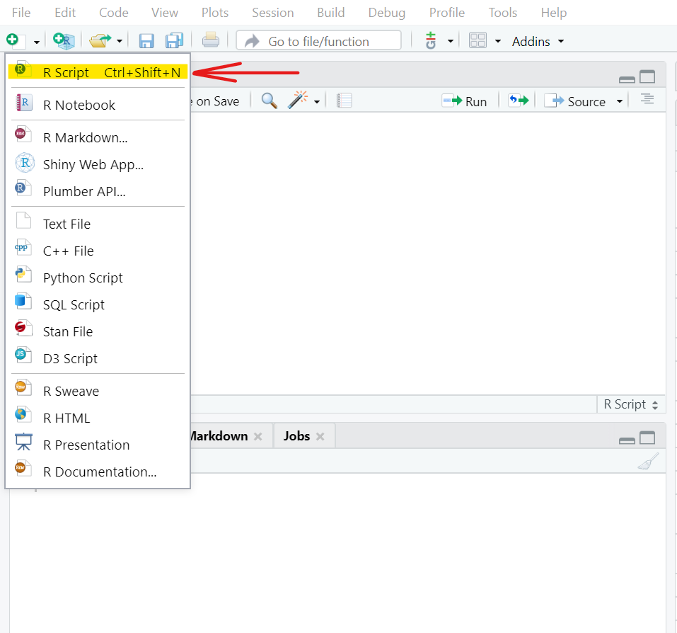

# Primeros calculos en R {#intro}

La idea es familiarizarse con el entorno de **R** y definirlo como lo que es, una "calculadora". Es por esto que una forma de hacer calculos con la base instrumental que trae el programa, se presenta a continuación.

\BeginKnitrBlock{example}\iffalse{-91-79-112-101-114-97-99-105-111-110-101-115-32-98-225-115-105-99-97-115-93-}\fi{}<div class="example"><span class="example" id="exm:Pr1"><strong>(\#exm:Pr1)  \iffalse (Operaciones básicas) \fi{} </strong></span>Si intentamos sumar un par de números enteros es facíl tener:</div>\EndKnitrBlock{example}


```r
  3+5 #Una suma o adición
```

```
## [1] 8
```


Si por otro lado se quiere un producto de 1255 con la $\sqrt{25}$, entonces debe ser escrito de tal forma que


```r
1255*sqrt(25) #Producto con la raíz cuadrada de 25
```

```
## [1] 6275
```

Si se desea obtener una seguidilla de calculos ya toca escribirlos -*como si fuera una lista*- e implementarlos directamente, ya es:


```r
  13**2 #Potencia de un número
  300/25 #Simple división entre 300 y 25
  450+320+112 #Suma de tres números enteros
  sqrt(12) #La raíz cuadrada del número 12
```

Todas las operaciones que se deseen realizar en **R** que involucran operaciones matemáticas, pueden ser escritos directamente y obtendremos los resultados deseados.

Note que el operador (#) es para decirle al programa que no ejecute lo que se encuentra después de él, se usa para tomar notas o escribir algo al respecto en los archivos **script** de **R**, por ejemplo:


```r
#Soy carlos yanes
```

## Script o archivo tipo bitacora {#bit}

Los **script** son archivos que comunmente se desarrollan en formato de _texto_ o de _bloc de notas_. Constituye la forma de llevar y controlar los codigos que se van a implementar los calculos y se referencian como bitacoras o diario, en el cuál se trabaja. Regularmente vienen instalados en el programa de **R** en un formato clasico o si ya se hace uso de [R Studio](https://rstudio.com/products/rstudio/download/) que es un potente aliado^[Para mayor información consulte la pagina web o enlace de **R Studio**.] en el entorno de ejecución del programa **R**, se le denomina IDE^[Por sus siglas en ingles significa _Integrated Drive Electronics_, no es mas que un entorno de desarrollo interactivo que facilita interactuar mejor y de manera mas "amigable" con todos los asuntos de los lenguajes de programación].

Abrir un archivo tipo **script** en **R Studio** es sencillo, solo hay que ir al panel superior izquierdo del programa y debajo de la pestaña de File se encuentra el logo (+) y al dar _click_ se le desplegará la lista de opciones y en el, es solo volver a dar _click_ donde dice **R Script**, una forma mas rápida con el teclado es con las teclas `Ctrl+Shift+N`.  


Al crear un **script** en **R Studio**, podrá desarrollar y escribir los codigos con el cual va realizar su trabajo, por ejemplo:


## Otras operaciones y calculos

En economía y en muchas ciencias sociales se hace uso extensivo de las **matemáticas** y de la **estadística**. Muchas veces será incluso necesario calcular o realizar algunas transformaciones en las variables para poder tener unas métricas mas informativas como son los _logaritmos_, _valores absolutos_, valores de forma _exponencial_ o de notación científica, entre otros. Algunos comandos que se pueden usar en **R** para eso son:

| Operación     | Resultado     |
| ------------- | ------------- |
| Valor absoluto| abs()         |
| Logaritmo     | log()         |
| Logaritmo base| log(,)        |
| Exponencial   | exp()         |
| Factorial     | factorial()   |
| Raíz cuadrada | sqrt()        |

El *valor absoluto* de un número como por ejemplo puede ser simplemente:


```r
  abs(-3) # Es el valor absoluto de (-3)
```

```
## [1] 3
```
Sin embargo, en una operación conjunta, si se posee una lista de elementos o un **vector** de elementos, es mucho mas simple implementarlo de tal forma que:


```r
  x<-c(-3,-5,3,11,-16,18,21,-31,-33) # Lista de valores
  abs(x)
```

```
## [1]  3  5  3 11 16 18 21 31 33
```
De igual forma, funciona con un *logaritmo* o también una operación que involucre una de forma de notación cientifica o *exponencial*, esto puede notarse así:


```r
  y<-c(15,21,23,29,16,28,32,45,33) # Lista de valores para vector Y
  log(y) #Se calcula el logaritmo de cada uno de los elementos
```

```
## [1] 2.708050 3.044522 3.135494 3.367296 2.772589 3.332205 3.465736 3.806662
## [9] 3.496508
```
Observe que el **Programa** calcula el logaritmo natural de cada uno de los elementos del vector (y). Para la forma *exponencial*, es de uso de la notación del logaritmo base e y que muchos conocen como la expresión de **Euler**, e.g: $e^{x}$, recuerde ademas que si este lo usamos de tal manera que $Y=ln(e^{x})=x$. Un ejemplo de aplicación es

```r
  x<-150 
  exp(x) # En R exp hace referencia a la formula de (e)
```

```
## [1] 1.39371e+65
```
