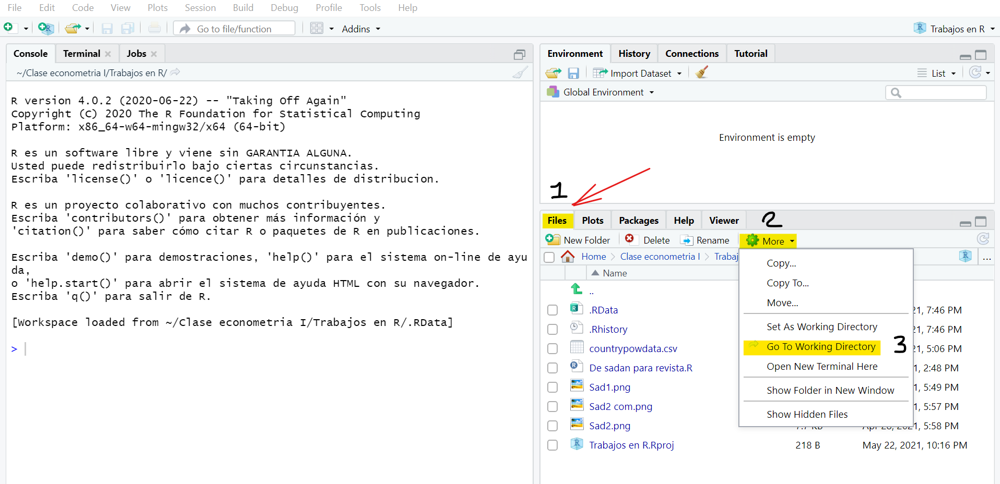

# Datos

Una de las cosas mas importantes que debe hacer todo economista al hacer uso de **R**, es importar las **bases de datos** con las que pretende trabajar y armar su *proyecto*. Los datos vienen desde distintos formatos y poseen varias clasificaciones, recordemos algunos conceptos claves para avanzar

- **Base de datos**: Es una colección especifica de datos.
- Que posee un **formato** ``popular'', es decir, es una tabla de forma de (matrices)
- También es de forma *rectangular*, cuya organización aborda un número de **filas** y **columnas**.
- Una **fila** tiene datos de una o varias *variables* para un mismo **individuo**.
- Una **columna** contiene valores de una *variable* para muchos individuos.

Por otro lado, podemos tener <span style="color:blue"> datos </span> de los siguientes tipos:

- <span style="color:red">Índices</span>: Es la parte de nombres, números de identificación o cuestionario en una base de datos.
- <span style="color:red">Binarios</span>: Variables que tienen sólo dos posibles respuestas. Ej: Si, no; Femenino, masculino, etc. Se codifican con (0 y 1), y se les conoce como variable *dummy*.
- <span style="color:red">De conteo</span>: Números enteros de no negación.
- <span style="color:red">Continuos</span>: Aquellos que admiten decimales.
- <span style="color:red">Nominales</span>: Respuestas no ordenadas y que amplían el espectro de las variables binarias, suelen ser datos categóricos. 
- <span style="color:red">Ordinales</span>: Admiten respuestas nominales pero en esencia *ordenadas* y son codificadas con números.


## Estructuras de datos usualmente utilizadas en econometría

En economía regularmente se trabaja con tres tipos de bases de datos conocidos como **Corte Transversal**, **Series de Tiempo** y **Paneles longitudinales**.

### Datos de corte transversal

Son aquellas *bases* que regularmente tienen información en un solo periodo de tiempo y que varían por individuos, instituciones, países o empresas. Se denotan sus observaciones con el subíndice (i), por ejemplo: $X_{i}$. Donde $X$ hace referencia a cada una de las variables como el nombre, la edad, los ingresos, etc. Y la parte de (i) de los _individuos_. Esto puede ser por ejemplo la variable $Edad_{i}$, donde (i) toma los nombres Diego, Marcela, Angela, Carlos y será la edad correspondiente de cada uno de ellos. Mire que si lo escribimos en un vector con datos, esto es:

\begin{equation*}
Edad_{i}= \{ 21, 19, 23, 25 \}
\end{equation*}

Una tabla mas general, con distintas variables por individuos es este:

```{=html}
<template id="cf0150c8-22fe-4050-9d98-2660ea01c397"><style>
.tabwid table{
  border-collapse:collapse;
  line-height:1;
  margin-left:auto;
  margin-right:auto;
  border-width: 0;
  display: table;
  margin-top: 1.275em;
  margin-bottom: 1.275em;
  border-spacing: 0;
  border-color: transparent;
}
.tabwid_left table{
  margin-left:0;
}
.tabwid_right table{
  margin-right:0;
}
.tabwid td {
    padding: 0;
}
.tabwid a {
  text-decoration: none;
}
.tabwid thead {
    background-color: transparent;
}
.tabwid tfoot {
    background-color: transparent;
}
.tabwid table tr {
background-color: transparent;
}
</style><div class="tabwid"><style>.cl-e045e410{border-collapse:collapse;}.cl-e03aedb2{font-family:'Arial';font-size:11pt;font-weight:bold;font-style:normal;text-decoration:none;color:rgba(236, 147, 70, 1.00);background-color:transparent;}.cl-e03aedb3{font-family:'Arial';font-size:11pt;font-weight:normal;font-style:normal;text-decoration:none;color:rgba(164, 206, 229, 1.00);background-color:transparent;}.cl-e03b14c2{margin:0;text-align:left;border-bottom: 0 solid rgba(0, 0, 0, 1.00);border-top: 0 solid rgba(0, 0, 0, 1.00);border-left: 0 solid rgba(0, 0, 0, 1.00);border-right: 0 solid rgba(0, 0, 0, 1.00);padding-bottom:5pt;padding-top:5pt;padding-left:5pt;padding-right:5pt;line-height: 1;background-color:transparent;}.cl-e03b14c3{margin:0;text-align:right;border-bottom: 0 solid rgba(0, 0, 0, 1.00);border-top: 0 solid rgba(0, 0, 0, 1.00);border-left: 0 solid rgba(0, 0, 0, 1.00);border-right: 0 solid rgba(0, 0, 0, 1.00);padding-bottom:5pt;padding-top:5pt;padding-left:5pt;padding-right:5pt;line-height: 1;background-color:transparent;}.cl-e03b6044{width:47.4pt;background-clip: padding-box;background-color:rgba(0, 0, 0, 1.00);vertical-align: middle;border-bottom: 1pt solid rgba(164, 206, 229, 1.00);border-top: 1pt solid rgba(164, 206, 229, 1.00);border-left: 1pt solid rgba(164, 206, 229, 1.00);border-right: 1pt solid rgba(164, 206, 229, 1.00);margin-bottom:0;margin-top:0;margin-left:0;margin-right:0;}.cl-e03b6045{width:146.5pt;background-clip: padding-box;background-color:rgba(0, 0, 0, 1.00);vertical-align: middle;border-bottom: 1pt solid rgba(164, 206, 229, 1.00);border-top: 1pt solid rgba(164, 206, 229, 1.00);border-left: 1pt solid rgba(164, 206, 229, 1.00);border-right: 1pt solid rgba(164, 206, 229, 1.00);margin-bottom:0;margin-top:0;margin-left:0;margin-right:0;}.cl-e03b6046{width:91.4pt;background-clip: padding-box;background-color:rgba(0, 0, 0, 1.00);vertical-align: middle;border-bottom: 1pt solid rgba(164, 206, 229, 1.00);border-top: 1pt solid rgba(164, 206, 229, 1.00);border-left: 1pt solid rgba(164, 206, 229, 1.00);border-right: 1pt solid rgba(164, 206, 229, 1.00);margin-bottom:0;margin-top:0;margin-left:0;margin-right:0;}.cl-e03b6047{width:75.6pt;background-clip: padding-box;background-color:rgba(0, 0, 0, 1.00);vertical-align: middle;border-bottom: 1pt solid rgba(164, 206, 229, 1.00);border-top: 1pt solid rgba(164, 206, 229, 1.00);border-left: 1pt solid rgba(164, 206, 229, 1.00);border-right: 1pt solid rgba(164, 206, 229, 1.00);margin-bottom:0;margin-top:0;margin-left:0;margin-right:0;}.cl-e03b6048{width:83.5pt;background-clip: padding-box;background-color:rgba(0, 0, 0, 1.00);vertical-align: middle;border-bottom: 1pt solid rgba(164, 206, 229, 1.00);border-top: 1pt solid rgba(164, 206, 229, 1.00);border-left: 1pt solid rgba(164, 206, 229, 1.00);border-right: 1pt solid rgba(164, 206, 229, 1.00);margin-bottom:0;margin-top:0;margin-left:0;margin-right:0;}.cl-e03b6049{width:52.3pt;background-clip: padding-box;background-color:rgba(0, 0, 0, 1.00);vertical-align: middle;border-bottom: 1pt solid rgba(164, 206, 229, 1.00);border-top: 1pt solid rgba(164, 206, 229, 1.00);border-left: 1pt solid rgba(164, 206, 229, 1.00);border-right: 1pt solid rgba(164, 206, 229, 1.00);margin-bottom:0;margin-top:0;margin-left:0;margin-right:0;}.cl-e03b604a{width:46.8pt;background-clip: padding-box;background-color:rgba(0, 0, 0, 1.00);vertical-align: middle;border-bottom: 1pt solid rgba(164, 206, 229, 1.00);border-top: 1pt solid rgba(164, 206, 229, 1.00);border-left: 1pt solid rgba(164, 206, 229, 1.00);border-right: 1pt solid rgba(164, 206, 229, 1.00);margin-bottom:0;margin-top:0;margin-left:0;margin-right:0;}.cl-e03b604b{width:52.3pt;background-clip: padding-box;background-color:rgba(0, 0, 0, 1.00);vertical-align: middle;border-bottom: 1pt solid rgba(164, 206, 229, 1.00);border-top: 1pt solid rgba(164, 206, 229, 1.00);border-left: 1pt solid rgba(164, 206, 229, 1.00);border-right: 1pt solid rgba(164, 206, 229, 1.00);margin-bottom:0;margin-top:0;margin-left:0;margin-right:0;}.cl-e03b604c{width:83.5pt;background-clip: padding-box;background-color:rgba(0, 0, 0, 1.00);vertical-align: middle;border-bottom: 1pt solid rgba(164, 206, 229, 1.00);border-top: 1pt solid rgba(164, 206, 229, 1.00);border-left: 1pt solid rgba(164, 206, 229, 1.00);border-right: 1pt solid rgba(164, 206, 229, 1.00);margin-bottom:0;margin-top:0;margin-left:0;margin-right:0;}.cl-e03b604d{width:146.5pt;background-clip: padding-box;background-color:rgba(0, 0, 0, 1.00);vertical-align: middle;border-bottom: 1pt solid rgba(164, 206, 229, 1.00);border-top: 1pt solid rgba(164, 206, 229, 1.00);border-left: 1pt solid rgba(164, 206, 229, 1.00);border-right: 1pt solid rgba(164, 206, 229, 1.00);margin-bottom:0;margin-top:0;margin-left:0;margin-right:0;}.cl-e03b604e{width:47.4pt;background-clip: padding-box;background-color:rgba(0, 0, 0, 1.00);vertical-align: middle;border-bottom: 1pt solid rgba(164, 206, 229, 1.00);border-top: 1pt solid rgba(164, 206, 229, 1.00);border-left: 1pt solid rgba(164, 206, 229, 1.00);border-right: 1pt solid rgba(164, 206, 229, 1.00);margin-bottom:0;margin-top:0;margin-left:0;margin-right:0;}.cl-e03b88da{width:75.6pt;background-clip: padding-box;background-color:rgba(0, 0, 0, 1.00);vertical-align: middle;border-bottom: 1pt solid rgba(164, 206, 229, 1.00);border-top: 1pt solid rgba(164, 206, 229, 1.00);border-left: 1pt solid rgba(164, 206, 229, 1.00);border-right: 1pt solid rgba(164, 206, 229, 1.00);margin-bottom:0;margin-top:0;margin-left:0;margin-right:0;}.cl-e03b88db{width:46.8pt;background-clip: padding-box;background-color:rgba(0, 0, 0, 1.00);vertical-align: middle;border-bottom: 1pt solid rgba(164, 206, 229, 1.00);border-top: 1pt solid rgba(164, 206, 229, 1.00);border-left: 1pt solid rgba(164, 206, 229, 1.00);border-right: 1pt solid rgba(164, 206, 229, 1.00);margin-bottom:0;margin-top:0;margin-left:0;margin-right:0;}.cl-e03b88dc{width:91.4pt;background-clip: padding-box;background-color:rgba(0, 0, 0, 1.00);vertical-align: middle;border-bottom: 1pt solid rgba(164, 206, 229, 1.00);border-top: 1pt solid rgba(164, 206, 229, 1.00);border-left: 1pt solid rgba(164, 206, 229, 1.00);border-right: 1pt solid rgba(164, 206, 229, 1.00);margin-bottom:0;margin-top:0;margin-left:0;margin-right:0;}.cl-e03b88dd{width:83.5pt;background-clip: padding-box;background-color:rgba(0, 0, 0, 1.00);vertical-align: middle;border-bottom: 1pt solid rgba(164, 206, 229, 1.00);border-top: 1pt solid rgba(164, 206, 229, 1.00);border-left: 1pt solid rgba(164, 206, 229, 1.00);border-right: 1pt solid rgba(164, 206, 229, 1.00);margin-bottom:0;margin-top:0;margin-left:0;margin-right:0;}.cl-e03b88de{width:52.3pt;background-clip: padding-box;background-color:rgba(0, 0, 0, 1.00);vertical-align: middle;border-bottom: 1pt solid rgba(164, 206, 229, 1.00);border-top: 1pt solid rgba(164, 206, 229, 1.00);border-left: 1pt solid rgba(164, 206, 229, 1.00);border-right: 1pt solid rgba(164, 206, 229, 1.00);margin-bottom:0;margin-top:0;margin-left:0;margin-right:0;}.cl-e03b88df{width:75.6pt;background-clip: padding-box;background-color:rgba(0, 0, 0, 1.00);vertical-align: middle;border-bottom: 1pt solid rgba(164, 206, 229, 1.00);border-top: 1pt solid rgba(164, 206, 229, 1.00);border-left: 1pt solid rgba(164, 206, 229, 1.00);border-right: 1pt solid rgba(164, 206, 229, 1.00);margin-bottom:0;margin-top:0;margin-left:0;margin-right:0;}.cl-e03b88e0{width:47.4pt;background-clip: padding-box;background-color:rgba(0, 0, 0, 1.00);vertical-align: middle;border-bottom: 1pt solid rgba(164, 206, 229, 1.00);border-top: 1pt solid rgba(164, 206, 229, 1.00);border-left: 1pt solid rgba(164, 206, 229, 1.00);border-right: 1pt solid rgba(164, 206, 229, 1.00);margin-bottom:0;margin-top:0;margin-left:0;margin-right:0;}.cl-e03b88e1{width:91.4pt;background-clip: padding-box;background-color:rgba(0, 0, 0, 1.00);vertical-align: middle;border-bottom: 1pt solid rgba(164, 206, 229, 1.00);border-top: 1pt solid rgba(164, 206, 229, 1.00);border-left: 1pt solid rgba(164, 206, 229, 1.00);border-right: 1pt solid rgba(164, 206, 229, 1.00);margin-bottom:0;margin-top:0;margin-left:0;margin-right:0;}.cl-e03b88e2{width:46.8pt;background-clip: padding-box;background-color:rgba(0, 0, 0, 1.00);vertical-align: middle;border-bottom: 1pt solid rgba(164, 206, 229, 1.00);border-top: 1pt solid rgba(164, 206, 229, 1.00);border-left: 1pt solid rgba(164, 206, 229, 1.00);border-right: 1pt solid rgba(164, 206, 229, 1.00);margin-bottom:0;margin-top:0;margin-left:0;margin-right:0;}.cl-e03b88e3{width:146.5pt;background-clip: padding-box;background-color:rgba(0, 0, 0, 1.00);vertical-align: middle;border-bottom: 1pt solid rgba(164, 206, 229, 1.00);border-top: 1pt solid rgba(164, 206, 229, 1.00);border-left: 1pt solid rgba(164, 206, 229, 1.00);border-right: 1pt solid rgba(164, 206, 229, 1.00);margin-bottom:0;margin-top:0;margin-left:0;margin-right:0;}.cl-e03b88e4{width:83.5pt;background-clip: padding-box;background-color:rgba(0, 0, 0, 1.00);vertical-align: middle;border-bottom: 1pt solid rgba(164, 206, 229, 1.00);border-top: 1pt solid rgba(164, 206, 229, 1.00);border-left: 1pt solid rgba(164, 206, 229, 1.00);border-right: 1pt solid rgba(164, 206, 229, 1.00);margin-bottom:0;margin-top:0;margin-left:0;margin-right:0;}.cl-e03bb094{width:146.5pt;background-clip: padding-box;background-color:rgba(0, 0, 0, 1.00);vertical-align: middle;border-bottom: 1pt solid rgba(164, 206, 229, 1.00);border-top: 1pt solid rgba(164, 206, 229, 1.00);border-left: 1pt solid rgba(164, 206, 229, 1.00);border-right: 1pt solid rgba(164, 206, 229, 1.00);margin-bottom:0;margin-top:0;margin-left:0;margin-right:0;}.cl-e03bb095{width:75.6pt;background-clip: padding-box;background-color:rgba(0, 0, 0, 1.00);vertical-align: middle;border-bottom: 1pt solid rgba(164, 206, 229, 1.00);border-top: 1pt solid rgba(164, 206, 229, 1.00);border-left: 1pt solid rgba(164, 206, 229, 1.00);border-right: 1pt solid rgba(164, 206, 229, 1.00);margin-bottom:0;margin-top:0;margin-left:0;margin-right:0;}.cl-e03bb096{width:47.4pt;background-clip: padding-box;background-color:rgba(0, 0, 0, 1.00);vertical-align: middle;border-bottom: 1pt solid rgba(164, 206, 229, 1.00);border-top: 1pt solid rgba(164, 206, 229, 1.00);border-left: 1pt solid rgba(164, 206, 229, 1.00);border-right: 1pt solid rgba(164, 206, 229, 1.00);margin-bottom:0;margin-top:0;margin-left:0;margin-right:0;}.cl-e03bb097{width:91.4pt;background-clip: padding-box;background-color:rgba(0, 0, 0, 1.00);vertical-align: middle;border-bottom: 1pt solid rgba(164, 206, 229, 1.00);border-top: 1pt solid rgba(164, 206, 229, 1.00);border-left: 1pt solid rgba(164, 206, 229, 1.00);border-right: 1pt solid rgba(164, 206, 229, 1.00);margin-bottom:0;margin-top:0;margin-left:0;margin-right:0;}.cl-e03bb098{width:46.8pt;background-clip: padding-box;background-color:rgba(0, 0, 0, 1.00);vertical-align: middle;border-bottom: 1pt solid rgba(164, 206, 229, 1.00);border-top: 1pt solid rgba(164, 206, 229, 1.00);border-left: 1pt solid rgba(164, 206, 229, 1.00);border-right: 1pt solid rgba(164, 206, 229, 1.00);margin-bottom:0;margin-top:0;margin-left:0;margin-right:0;}.cl-e03bb099{width:52.3pt;background-clip: padding-box;background-color:rgba(0, 0, 0, 1.00);vertical-align: middle;border-bottom: 1pt solid rgba(164, 206, 229, 1.00);border-top: 1pt solid rgba(164, 206, 229, 1.00);border-left: 1pt solid rgba(164, 206, 229, 1.00);border-right: 1pt solid rgba(164, 206, 229, 1.00);margin-bottom:0;margin-top:0;margin-left:0;margin-right:0;}</style><table class='cl-e045e410'>
```

```{=html}
<thead><tr style="overflow-wrap:break-word;"><td class="cl-e03b88e3"><p class="cl-e03b14c2"><span class="cl-e03aedb2">Nombre</span></p></td><td class="cl-e03b88df"><p class="cl-e03b14c3"><span class="cl-e03aedb2">Grado</span></p></td><td class="cl-e03b88e0"><p class="cl-e03b14c3"><span class="cl-e03aedb2">Edad</span></p></td><td class="cl-e03b88dd"><p class="cl-e03b14c3"><span class="cl-e03aedb2">Ingresos</span></p></td><td class="cl-e03b88e2"><p class="cl-e03b14c3"><span class="cl-e03aedb2">Peso</span></p></td><td class="cl-e03b88de"><p class="cl-e03b14c3"><span class="cl-e03aedb2">Altura</span></p></td><td class="cl-e03b88e1"><p class="cl-e03b14c2"><span class="cl-e03aedb2">Color_ojos</span></p></td></tr></thead><tbody><tr style="overflow-wrap:break-word;"><td class="cl-e03b6045"><p class="cl-e03b14c2"><span class="cl-e03aedb3">Matias Barrows-Jast</span></p></td><td class="cl-e03b6047"><p class="cl-e03b14c3"><span class="cl-e03aedb3">15/12/2022</span></p></td><td class="cl-e03b6044"><p class="cl-e03b14c3"><span class="cl-e03aedb3"># 27</span></p></td><td class="cl-e03b6048"><p class="cl-e03b14c3"><span class="cl-e03aedb3">$880 588</span></p></td><td class="cl-e03b604a"><p class="cl-e03b14c3"><span class="cl-e03aedb3">56,7</span></p></td><td class="cl-e03b6049"><p class="cl-e03b14c3"><span class="cl-e03aedb3">180,8</span></p></td><td class="cl-e03b6046"><p class="cl-e03b14c2"><span class="cl-e03aedb3">color: Verdes</span></p></td></tr><tr style="overflow-wrap:break-word;"><td class="cl-e03b604d"><p class="cl-e03b14c2"><span class="cl-e03aedb3">Kayson Franecki</span></p></td><td class="cl-e03b88da"><p class="cl-e03b14c3"><span class="cl-e03aedb3">08/05/2000</span></p></td><td class="cl-e03b604e"><p class="cl-e03b14c3"><span class="cl-e03aedb3"># 26</span></p></td><td class="cl-e03b604c"><p class="cl-e03b14c3"><span class="cl-e03aedb3">No responde</span></p></td><td class="cl-e03b88db"><p class="cl-e03b14c3"><span class="cl-e03aedb3">64,6</span></p></td><td class="cl-e03b604b"><p class="cl-e03b14c3"><span class="cl-e03aedb3">176,0</span></p></td><td class="cl-e03b88dc"><p class="cl-e03b14c2"><span class="cl-e03aedb3">color: Oscuros</span></p></td></tr><tr style="overflow-wrap:break-word;"><td class="cl-e03b88e3"><p class="cl-e03b14c2"><span class="cl-e03aedb3">Garrick Langworth</span></p></td><td class="cl-e03b88df"><p class="cl-e03b14c3"><span class="cl-e03aedb3">05/03/2032</span></p></td><td class="cl-e03b88e0"><p class="cl-e03b14c3"><span class="cl-e03aedb3"># 22</span></p></td><td class="cl-e03b88dd"><p class="cl-e03b14c3"><span class="cl-e03aedb3">No responde</span></p></td><td class="cl-e03b88e2"><p class="cl-e03b14c3"><span class="cl-e03aedb3">90,1</span></p></td><td class="cl-e03b88de"><p class="cl-e03b14c3"><span class="cl-e03aedb3">164,4</span></p></td><td class="cl-e03b88e1"><p class="cl-e03b14c2"><span class="cl-e03aedb3">color: Oscuros</span></p></td></tr><tr style="overflow-wrap:break-word;"><td class="cl-e03bb094"><p class="cl-e03b14c2"><span class="cl-e03aedb3">Cordell Dickens</span></p></td><td class="cl-e03bb095"><p class="cl-e03b14c3"><span class="cl-e03aedb3">21/04/2040</span></p></td><td class="cl-e03bb096"><p class="cl-e03b14c3"><span class="cl-e03aedb3"># 25</span></p></td><td class="cl-e03b88e4"><p class="cl-e03b14c3"><span class="cl-e03aedb3">No responde</span></p></td><td class="cl-e03bb098"><p class="cl-e03b14c3"><span class="cl-e03aedb3">75,1</span></p></td><td class="cl-e03bb099"><p class="cl-e03b14c3"><span class="cl-e03aedb3">168,0</span></p></td><td class="cl-e03bb097"><p class="cl-e03b14c2"><span class="cl-e03aedb3">color: Azules</span></p></td></tr><tr style="overflow-wrap:break-word;"><td class="cl-e03b604d"><p class="cl-e03b14c2"><span class="cl-e03aedb3">Destiney Dicki</span></p></td><td class="cl-e03b88da"><p class="cl-e03b14c3"><span class="cl-e03aedb3">07/06/2016</span></p></td><td class="cl-e03b604e"><p class="cl-e03b14c3"><span class="cl-e03aedb3"># 28</span></p></td><td class="cl-e03b604c"><p class="cl-e03b14c3"><span class="cl-e03aedb3">$415 902</span></p></td><td class="cl-e03b88db"><p class="cl-e03b14c3"><span class="cl-e03aedb3">97,3</span></p></td><td class="cl-e03b604b"><p class="cl-e03b14c3"><span class="cl-e03aedb3">167,7</span></p></td><td class="cl-e03b88dc"><p class="cl-e03b14c2"><span class="cl-e03aedb3">color: Oscuros</span></p></td></tr><tr style="overflow-wrap:break-word;"><td class="cl-e03b6045"><p class="cl-e03b14c2"><span class="cl-e03aedb3">Mrs. Freddie Pouros DDS</span></p></td><td class="cl-e03b6047"><p class="cl-e03b14c3"><span class="cl-e03aedb3">29/09/2017</span></p></td><td class="cl-e03b6044"><p class="cl-e03b14c3"><span class="cl-e03aedb3"># 32</span></p></td><td class="cl-e03b6048"><p class="cl-e03b14c3"><span class="cl-e03aedb3">$784 231</span></p></td><td class="cl-e03b604a"><p class="cl-e03b14c3"><span class="cl-e03aedb3">56,2</span></p></td><td class="cl-e03b6049"><p class="cl-e03b14c3"><span class="cl-e03aedb3">173,9</span></p></td><td class="cl-e03b6046"><p class="cl-e03b14c2"><span class="cl-e03aedb3">color: Azules</span></p></td></tr><tr style="overflow-wrap:break-word;"><td class="cl-e03b6045"><p class="cl-e03b14c2"><span class="cl-e03aedb3">Ms. Jada Lesch</span></p></td><td class="cl-e03b6047"><p class="cl-e03b14c3"><span class="cl-e03aedb3">18/09/2028</span></p></td><td class="cl-e03b6044"><p class="cl-e03b14c3"><span class="cl-e03aedb3"># 33</span></p></td><td class="cl-e03b6048"><p class="cl-e03b14c3"><span class="cl-e03aedb3">$942 982</span></p></td><td class="cl-e03b604a"><p class="cl-e03b14c3"><span class="cl-e03aedb3">76,1</span></p></td><td class="cl-e03b6049"><p class="cl-e03b14c3"><span class="cl-e03aedb3">169,6</span></p></td><td class="cl-e03b6046"><p class="cl-e03b14c2"><span class="cl-e03aedb3">color: Azules</span></p></td></tr></tbody></table></div></template>
<div class="flextable-shadow-host" id="419d9615-76ca-4826-b9a4-1fca5364b336"></div>
<script>
var dest = document.getElementById("419d9615-76ca-4826-b9a4-1fca5364b336");
var template = document.getElementById("cf0150c8-22fe-4050-9d98-2660ea01c397");
var caption = template.content.querySelector("caption");
if(caption) {
  caption.style.cssText = "display:block;text-align:center;";
  var newcapt = document.createElement("p");
  newcapt.appendChild(caption)
  dest.parentNode.insertBefore(newcapt, dest.previousSibling);
}
var fantome = dest.attachShadow({mode: 'open'});
var templateContent = template.content;
fantome.appendChild(templateContent);
</script>

```

### Datos de series de tiempo
Por otro lado, existen bases que tienen en común un individuo (i), pero que varian en el tiempo. Los datos de este tipo suelen ser denominados **macroeconómicos** o series "Macro", un ejemplo de esto es el PIB de un país cualquiera desde el año de 2015 al 2021. Las series se denotan con el subíndice (t) que hace referencia al periodo de estudio, es decir, $X_{t}$.

```{=html}
<template id="131431ec-9cb5-4b30-9919-ff1a4e74cf1c"><style>
.tabwid table{
  border-collapse:collapse;
  line-height:1;
  margin-left:auto;
  margin-right:auto;
  border-width: 0;
  display: table;
  margin-top: 1.275em;
  margin-bottom: 1.275em;
  border-spacing: 0;
  border-color: transparent;
}
.tabwid_left table{
  margin-left:0;
}
.tabwid_right table{
  margin-right:0;
}
.tabwid td {
    padding: 0;
}
.tabwid a {
  text-decoration: none;
}
.tabwid thead {
    background-color: transparent;
}
.tabwid tfoot {
    background-color: transparent;
}
.tabwid table tr {
background-color: transparent;
}
</style><div class="tabwid"><style>.cl-e064f4b8{border-collapse:collapse;}.cl-e05cce64{font-family:'Arial';font-size:11pt;font-weight:bold;font-style:normal;text-decoration:none;color:rgba(236, 147, 70, 1.00);background-color:transparent;}.cl-e05cce65{font-family:'Arial';font-size:11pt;font-weight:normal;font-style:normal;text-decoration:none;color:rgba(164, 206, 229, 1.00);background-color:transparent;}.cl-e05cce66{margin:0;text-align:left;border-bottom: 0 solid rgba(0, 0, 0, 1.00);border-top: 0 solid rgba(0, 0, 0, 1.00);border-left: 0 solid rgba(0, 0, 0, 1.00);border-right: 0 solid rgba(0, 0, 0, 1.00);padding-bottom:5pt;padding-top:5pt;padding-left:5pt;padding-right:5pt;line-height: 1;background-color:transparent;}.cl-e05cce67{margin:0;text-align:right;border-bottom: 0 solid rgba(0, 0, 0, 1.00);border-top: 0 solid rgba(0, 0, 0, 1.00);border-left: 0 solid rgba(0, 0, 0, 1.00);border-right: 0 solid rgba(0, 0, 0, 1.00);padding-bottom:5pt;padding-top:5pt;padding-left:5pt;padding-right:5pt;line-height: 1;background-color:transparent;}.cl-e05d6af4{width:48.1pt;background-clip: padding-box;background-color:rgba(0, 0, 0, 1.00);vertical-align: middle;border-bottom: 1pt solid rgba(164, 206, 229, 1.00);border-top: 1pt solid rgba(164, 206, 229, 1.00);border-left: 1pt solid rgba(164, 206, 229, 1.00);border-right: 1pt solid rgba(164, 206, 229, 1.00);margin-bottom:0;margin-top:0;margin-left:0;margin-right:0;}.cl-e05d6af5{width:101.3pt;background-clip: padding-box;background-color:rgba(0, 0, 0, 1.00);vertical-align: middle;border-bottom: 1pt solid rgba(164, 206, 229, 1.00);border-top: 1pt solid rgba(164, 206, 229, 1.00);border-left: 1pt solid rgba(164, 206, 229, 1.00);border-right: 1pt solid rgba(164, 206, 229, 1.00);margin-bottom:0;margin-top:0;margin-left:0;margin-right:0;}.cl-e05d6af6{width:45pt;background-clip: padding-box;background-color:rgba(0, 0, 0, 1.00);vertical-align: middle;border-bottom: 1pt solid rgba(164, 206, 229, 1.00);border-top: 1pt solid rgba(164, 206, 229, 1.00);border-left: 1pt solid rgba(164, 206, 229, 1.00);border-right: 1pt solid rgba(164, 206, 229, 1.00);margin-bottom:0;margin-top:0;margin-left:0;margin-right:0;}.cl-e05d6af7{width:101.3pt;background-clip: padding-box;background-color:rgba(0, 0, 0, 1.00);vertical-align: middle;border-bottom: 1pt solid rgba(164, 206, 229, 1.00);border-top: 1pt solid rgba(164, 206, 229, 1.00);border-left: 1pt solid rgba(164, 206, 229, 1.00);border-right: 1pt solid rgba(164, 206, 229, 1.00);margin-bottom:0;margin-top:0;margin-left:0;margin-right:0;}.cl-e05d6af8{width:48.1pt;background-clip: padding-box;background-color:rgba(0, 0, 0, 1.00);vertical-align: middle;border-bottom: 1pt solid rgba(164, 206, 229, 1.00);border-top: 1pt solid rgba(164, 206, 229, 1.00);border-left: 1pt solid rgba(164, 206, 229, 1.00);border-right: 1pt solid rgba(164, 206, 229, 1.00);margin-bottom:0;margin-top:0;margin-left:0;margin-right:0;}.cl-e05d6af9{width:45pt;background-clip: padding-box;background-color:rgba(0, 0, 0, 1.00);vertical-align: middle;border-bottom: 1pt solid rgba(164, 206, 229, 1.00);border-top: 1pt solid rgba(164, 206, 229, 1.00);border-left: 1pt solid rgba(164, 206, 229, 1.00);border-right: 1pt solid rgba(164, 206, 229, 1.00);margin-bottom:0;margin-top:0;margin-left:0;margin-right:0;}</style><table class='cl-e064f4b8'>
```

```{=html}
<thead><tr style="overflow-wrap:break-word;"><td class="cl-e05d6af9"><p class="cl-e05cce66"><span class="cl-e05cce64">t</span></p></td><td class="cl-e05d6af7"><p class="cl-e05cce67"><span class="cl-e05cce64">PIB</span></p></td><td class="cl-e05d6af8"><p class="cl-e05cce67"><span class="cl-e05cce64">IPC</span></p></td></tr></thead><tbody><tr style="overflow-wrap:break-word;"><td class="cl-e05d6af6"><p class="cl-e05cce66"><span class="cl-e05cce65">2015</span></p></td><td class="cl-e05d6af5"><p class="cl-e05cce67"><span class="cl-e05cce65">110.77 Mill. de $</span></p></td><td class="cl-e05d6af4"><p class="cl-e05cce67"><span class="cl-e05cce65">77,3</span></p></td></tr><tr style="overflow-wrap:break-word;"><td class="cl-e05d6af6"><p class="cl-e05cce66"><span class="cl-e05cce65">2016</span></p></td><td class="cl-e05d6af5"><p class="cl-e05cce67"><span class="cl-e05cce65">133.89 Mill. de $</span></p></td><td class="cl-e05d6af4"><p class="cl-e05cce67"><span class="cl-e05cce65">83,1</span></p></td></tr><tr style="overflow-wrap:break-word;"><td class="cl-e05d6af6"><p class="cl-e05cce66"><span class="cl-e05cce65">2017</span></p></td><td class="cl-e05d6af5"><p class="cl-e05cce67"><span class="cl-e05cce65">259.11 Mill. de $</span></p></td><td class="cl-e05d6af4"><p class="cl-e05cce67"><span class="cl-e05cce65">85,5</span></p></td></tr><tr style="overflow-wrap:break-word;"><td class="cl-e05d6af6"><p class="cl-e05cce66"><span class="cl-e05cce65">2018</span></p></td><td class="cl-e05d6af5"><p class="cl-e05cce67"><span class="cl-e05cce65">154.94 Mill. de $</span></p></td><td class="cl-e05d6af4"><p class="cl-e05cce67"><span class="cl-e05cce65">102,2</span></p></td></tr><tr style="overflow-wrap:break-word;"><td class="cl-e05d6af6"><p class="cl-e05cce66"><span class="cl-e05cce65">2019</span></p></td><td class="cl-e05d6af5"><p class="cl-e05cce67"><span class="cl-e05cce65">159.05 Mill. de $</span></p></td><td class="cl-e05d6af4"><p class="cl-e05cce67"><span class="cl-e05cce65">93,6</span></p></td></tr><tr style="overflow-wrap:break-word;"><td class="cl-e05d6af6"><p class="cl-e05cce66"><span class="cl-e05cce65">2020</span></p></td><td class="cl-e05d6af5"><p class="cl-e05cce67"><span class="cl-e05cce65">270.05 Mill. de $</span></p></td><td class="cl-e05d6af4"><p class="cl-e05cce67"><span class="cl-e05cce65">94,0</span></p></td></tr><tr style="overflow-wrap:break-word;"><td class="cl-e05d6af6"><p class="cl-e05cce66"><span class="cl-e05cce65">2021</span></p></td><td class="cl-e05d6af5"><p class="cl-e05cce67"><span class="cl-e05cce65">182.26 Mill. de $</span></p></td><td class="cl-e05d6af4"><p class="cl-e05cce67"><span class="cl-e05cce65">91,1</span></p></td></tr></tbody></table></div></template>
<div class="flextable-shadow-host" id="5b86f090-c057-427d-9a16-5506a7b29cf1"></div>
<script>
var dest = document.getElementById("5b86f090-c057-427d-9a16-5506a7b29cf1");
var template = document.getElementById("131431ec-9cb5-4b30-9919-ff1a4e74cf1c");
var caption = template.content.querySelector("caption");
if(caption) {
  caption.style.cssText = "display:block;text-align:center;";
  var newcapt = document.createElement("p");
  newcapt.appendChild(caption)
  dest.parentNode.insertBefore(newcapt, dest.previousSibling);
}
var fantome = dest.attachShadow({mode: 'open'});
var templateContent = template.content;
fantome.appendChild(templateContent);
</script>

```


### Panel Longitudinal

Los datos que provienen de un **Panel** son realizados por instituciones o empresas privadas que le hacen *seguimiento* a un individuo (i) en varios periodos de tiempo. Este tipo de datos se denota como $X_{it}$. Note que ahora hay dos subíndices, ya que se mide por tiempo e individuo.

```{=html}
<template id="59064ff2-2bec-4c8e-b331-8737e5e799f4"><style>
.tabwid table{
  border-collapse:collapse;
  line-height:1;
  margin-left:auto;
  margin-right:auto;
  border-width: 0;
  display: table;
  margin-top: 1.275em;
  margin-bottom: 1.275em;
  border-spacing: 0;
  border-color: transparent;
}
.tabwid_left table{
  margin-left:0;
}
.tabwid_right table{
  margin-right:0;
}
.tabwid td {
    padding: 0;
}
.tabwid a {
  text-decoration: none;
}
.tabwid thead {
    background-color: transparent;
}
.tabwid tfoot {
    background-color: transparent;
}
.tabwid table tr {
background-color: transparent;
}
</style><div class="tabwid"><style>.cl-e0855ce4{border-collapse:collapse;}.cl-e07cfdce{font-family:'Arial';font-size:11pt;font-weight:bold;font-style:normal;text-decoration:none;color:rgba(236, 147, 70, 1.00);background-color:transparent;}.cl-e07cfdcf{font-family:'Arial';font-size:11pt;font-weight:normal;font-style:normal;text-decoration:none;color:rgba(164, 206, 229, 1.00);background-color:transparent;}.cl-e07d24c0{margin:0;text-align:left;border-bottom: 0 solid rgba(0, 0, 0, 1.00);border-top: 0 solid rgba(0, 0, 0, 1.00);border-left: 0 solid rgba(0, 0, 0, 1.00);border-right: 0 solid rgba(0, 0, 0, 1.00);padding-bottom:5pt;padding-top:5pt;padding-left:5pt;padding-right:5pt;line-height: 1;background-color:transparent;}.cl-e07d24c1{margin:0;text-align:right;border-bottom: 0 solid rgba(0, 0, 0, 1.00);border-top: 0 solid rgba(0, 0, 0, 1.00);border-left: 0 solid rgba(0, 0, 0, 1.00);border-right: 0 solid rgba(0, 0, 0, 1.00);padding-bottom:5pt;padding-top:5pt;padding-left:5pt;padding-right:5pt;line-height: 1;background-color:transparent;}.cl-e07d4bbc{width:48.1pt;background-clip: padding-box;background-color:rgba(0, 0, 0, 1.00);vertical-align: middle;border-bottom: 1pt solid rgba(164, 206, 229, 1.00);border-top: 1pt solid rgba(164, 206, 229, 1.00);border-left: 1pt solid rgba(164, 206, 229, 1.00);border-right: 1pt solid rgba(164, 206, 229, 1.00);margin-bottom:0;margin-top:0;margin-left:0;margin-right:0;}.cl-e07d4bbd{width:67pt;background-clip: padding-box;background-color:rgba(0, 0, 0, 1.00);vertical-align: middle;border-bottom: 1pt solid rgba(164, 206, 229, 1.00);border-top: 1pt solid rgba(164, 206, 229, 1.00);border-left: 1pt solid rgba(164, 206, 229, 1.00);border-right: 1pt solid rgba(164, 206, 229, 1.00);margin-bottom:0;margin-top:0;margin-left:0;margin-right:0;}.cl-e07d4bbe{width:101.3pt;background-clip: padding-box;background-color:rgba(0, 0, 0, 1.00);vertical-align: middle;border-bottom: 1pt solid rgba(164, 206, 229, 1.00);border-top: 1pt solid rgba(164, 206, 229, 1.00);border-left: 1pt solid rgba(164, 206, 229, 1.00);border-right: 1pt solid rgba(164, 206, 229, 1.00);margin-bottom:0;margin-top:0;margin-left:0;margin-right:0;}.cl-e07d4bbf{width:45pt;background-clip: padding-box;background-color:rgba(0, 0, 0, 1.00);vertical-align: middle;border-bottom: 1pt solid rgba(164, 206, 229, 1.00);border-top: 1pt solid rgba(164, 206, 229, 1.00);border-left: 1pt solid rgba(164, 206, 229, 1.00);border-right: 1pt solid rgba(164, 206, 229, 1.00);margin-bottom:0;margin-top:0;margin-left:0;margin-right:0;}.cl-e07d4bc0{width:48.1pt;background-clip: padding-box;background-color:rgba(0, 0, 0, 1.00);vertical-align: middle;border-bottom: 1pt solid rgba(164, 206, 229, 1.00);border-top: 1pt solid rgba(164, 206, 229, 1.00);border-left: 1pt solid rgba(164, 206, 229, 1.00);border-right: 1pt solid rgba(164, 206, 229, 1.00);margin-bottom:0;margin-top:0;margin-left:0;margin-right:0;}.cl-e07d4bc1{width:67pt;background-clip: padding-box;background-color:rgba(0, 0, 0, 1.00);vertical-align: middle;border-bottom: 1pt solid rgba(164, 206, 229, 1.00);border-top: 1pt solid rgba(164, 206, 229, 1.00);border-left: 1pt solid rgba(164, 206, 229, 1.00);border-right: 1pt solid rgba(164, 206, 229, 1.00);margin-bottom:0;margin-top:0;margin-left:0;margin-right:0;}.cl-e07d4bc2{width:101.3pt;background-clip: padding-box;background-color:rgba(0, 0, 0, 1.00);vertical-align: middle;border-bottom: 1pt solid rgba(164, 206, 229, 1.00);border-top: 1pt solid rgba(164, 206, 229, 1.00);border-left: 1pt solid rgba(164, 206, 229, 1.00);border-right: 1pt solid rgba(164, 206, 229, 1.00);margin-bottom:0;margin-top:0;margin-left:0;margin-right:0;}.cl-e07d4bc3{width:45pt;background-clip: padding-box;background-color:rgba(0, 0, 0, 1.00);vertical-align: middle;border-bottom: 1pt solid rgba(164, 206, 229, 1.00);border-top: 1pt solid rgba(164, 206, 229, 1.00);border-left: 1pt solid rgba(164, 206, 229, 1.00);border-right: 1pt solid rgba(164, 206, 229, 1.00);margin-bottom:0;margin-top:0;margin-left:0;margin-right:0;}</style><table class='cl-e0855ce4'>
```

```{=html}
<thead><tr style="overflow-wrap:break-word;"><td class="cl-e07d4bc3"><p class="cl-e07d24c0"><span class="cl-e07cfdce">t</span></p></td><td class="cl-e07d4bc1"><p class="cl-e07d24c0"><span class="cl-e07cfdce">Paises</span></p></td><td class="cl-e07d4bc2"><p class="cl-e07d24c1"><span class="cl-e07cfdce">PIB</span></p></td><td class="cl-e07d4bc0"><p class="cl-e07d24c1"><span class="cl-e07cfdce">IPC</span></p></td></tr></thead><tbody><tr style="overflow-wrap:break-word;"><td class="cl-e07d4bbf"><p class="cl-e07d24c0"><span class="cl-e07cfdcf">2014</span></p></td><td class="cl-e07d4bbd"><p class="cl-e07d24c0"><span class="cl-e07cfdcf">Colombia</span></p></td><td class="cl-e07d4bbe"><p class="cl-e07d24c1"><span class="cl-e07cfdcf">234.31 Mill. de $</span></p></td><td class="cl-e07d4bbc"><p class="cl-e07d24c1"><span class="cl-e07cfdcf">108,0</span></p></td></tr><tr style="overflow-wrap:break-word;"><td class="cl-e07d4bbf"><p class="cl-e07d24c0"><span class="cl-e07cfdcf">2015</span></p></td><td class="cl-e07d4bbd"><p class="cl-e07d24c0"><span class="cl-e07cfdcf">Colombia</span></p></td><td class="cl-e07d4bbe"><p class="cl-e07d24c1"><span class="cl-e07cfdcf">116.51 Mill. de $</span></p></td><td class="cl-e07d4bbc"><p class="cl-e07d24c1"><span class="cl-e07cfdcf">103,9</span></p></td></tr><tr style="overflow-wrap:break-word;"><td class="cl-e07d4bbf"><p class="cl-e07d24c0"><span class="cl-e07cfdcf">2014</span></p></td><td class="cl-e07d4bbd"><p class="cl-e07d24c0"><span class="cl-e07cfdcf">Perú</span></p></td><td class="cl-e07d4bbe"><p class="cl-e07d24c1"><span class="cl-e07cfdcf">287.73 Mill. de $</span></p></td><td class="cl-e07d4bbc"><p class="cl-e07d24c1"><span class="cl-e07cfdcf">108,1</span></p></td></tr><tr style="overflow-wrap:break-word;"><td class="cl-e07d4bbf"><p class="cl-e07d24c0"><span class="cl-e07cfdcf">2015</span></p></td><td class="cl-e07d4bbd"><p class="cl-e07d24c0"><span class="cl-e07cfdcf">Perú</span></p></td><td class="cl-e07d4bbe"><p class="cl-e07d24c1"><span class="cl-e07cfdcf">113.82 Mill. de $</span></p></td><td class="cl-e07d4bbc"><p class="cl-e07d24c1"><span class="cl-e07cfdcf">91,0</span></p></td></tr><tr style="overflow-wrap:break-word;"><td class="cl-e07d4bbf"><p class="cl-e07d24c0"><span class="cl-e07cfdcf">2014</span></p></td><td class="cl-e07d4bbd"><p class="cl-e07d24c0"><span class="cl-e07cfdcf">Brasil</span></p></td><td class="cl-e07d4bbe"><p class="cl-e07d24c1"><span class="cl-e07cfdcf">177.37 Mill. de $</span></p></td><td class="cl-e07d4bbc"><p class="cl-e07d24c1"><span class="cl-e07cfdcf">93,3</span></p></td></tr><tr style="overflow-wrap:break-word;"><td class="cl-e07d4bbf"><p class="cl-e07d24c0"><span class="cl-e07cfdcf">2015</span></p></td><td class="cl-e07d4bbd"><p class="cl-e07d24c0"><span class="cl-e07cfdcf">Brasil</span></p></td><td class="cl-e07d4bbe"><p class="cl-e07d24c1"><span class="cl-e07cfdcf">110.42 Mill. de $</span></p></td><td class="cl-e07d4bbc"><p class="cl-e07d24c1"><span class="cl-e07cfdcf">99,3</span></p></td></tr><tr style="overflow-wrap:break-word;"><td class="cl-e07d4bbf"><p class="cl-e07d24c0"><span class="cl-e07cfdcf">2014</span></p></td><td class="cl-e07d4bbd"><p class="cl-e07d24c0"><span class="cl-e07cfdcf">Chile</span></p></td><td class="cl-e07d4bbe"><p class="cl-e07d24c1"><span class="cl-e07cfdcf">136.66 Mill. de $</span></p></td><td class="cl-e07d4bbc"><p class="cl-e07d24c1"><span class="cl-e07cfdcf">67,9</span></p></td></tr></tbody></table></div></template>
<div class="flextable-shadow-host" id="5a8920cc-8fb0-4e60-9cd7-91d681983b95"></div>
<script>
var dest = document.getElementById("5a8920cc-8fb0-4e60-9cd7-91d681983b95");
var template = document.getElementById("59064ff2-2bec-4c8e-b331-8737e5e799f4");
var caption = template.content.querySelector("caption");
if(caption) {
  caption.style.cssText = "display:block;text-align:center;";
  var newcapt = document.createElement("p");
  newcapt.appendChild(caption)
  dest.parentNode.insertBefore(newcapt, dest.previousSibling);
}
var fantome = dest.attachShadow({mode: 'open'});
var templateContent = template.content;
fantome.appendChild(templateContent);
</script>

```

## Importación de datos

Una de las cosas mas requeridas dentro del trabajo de **R** hace referencia a la importación de datos que no son propiamente de el. Aquellos datos o bases regularmente vienen en formatos de xml, csv, dta, asll, etc. Por ende, se hace necesario la implementación de comandos o de la ayuda directa del programa. Los paquetes declarados a continuación permiten realizar esto.


```r
library(foreign)    # Para convertir datos *.dta
library(haven)      # Para importar datos de otros programas
library(readxl)     # Para leer archivos de excel

#Ejemplo de una base de datos que esta en excel (debe tener cuidado con la ruta C:)
Pruebadatos <- read_excel("C:/Users/keyne/OneDrive/Escritorio/Pruebadatos.xlsx")
View(Pruebadatos)

#Exportar una base de datos desde R a formato CSV de excel con el comando "write"
write.csv(Pruebadatos, file = "archivodeprueba.csv")
```
Es de recordar que al exportar datos, estos quedan grabados en la carpeta de trabajo que se le ha establecido al programa desde un inicio. A continuación tres pasos para conocer donde se arrojan los archivos exportados y guardados en la ruta. 



Si tiene en cuenta lo anterior, lo primero es irse a la pestaña de `files`, luego le da `click` a la (tuerca) `more` y decirle ir al directorio de trabajo o `Go To Working Directory`. Si no desea esa carpeta, puede crear una en su computador con **new folder** y de ahí marcar la opción de `Set As Working Directory`. De esta manera podrá guardar todos sus archivos en esa ubicación.

## Datos propios en R

Algunas veces, se pueden vincular los datos propiamente al programa sin necesidad de importarlos. Se puede construir por *vectores*, estos a su vez se convierten o consideran como una lista de elementos que finalmente constituyen una columna de una base de datos o **dataframe**. Para mirar un caso de esto, mire el código a continuación:


```r
# Definimos un vector x para todos los años:
anos<- c(2018,2019,2020,2021,2022,2023)
# Definimos una matriz de y valores:
producto1<-c(10,13,16,19,17,18); producto2<-c(21,32,43,15,19,36); producto3<-c(22,43,42,21,32,21)
# Una forma de unir vectores es con el comando cbind
ventas_mat <- cbind(producto1,producto2,producto3) 
# Nombramos las filas con el vector de años:
rownames(ventas_mat) <- anos 
# La matriz de datos es:
ventas_mat
```

```
##      producto1 producto2 producto3
## 2018        10        21        22
## 2019        13        32        43
## 2020        16        43        42
## 2021        19        15        21
## 2022        17        19        32
## 2023        18        36        21
```

```r
# POr último le decimos que lo tome como data frame
ventas <- as.data.frame(ventas_mat)
```

La parte consecuente a **cbind** es para unir cada una de las columnas que se han venido creando. **R** trabaja con matrices, luego cada columna viene a ser un vector _columna_. Si la forma de unir fuera por filas, la opción a utilizar sería **rbind**.

### Trabajando con Data Frames

Para esta parte, es importante mirar todos los elementos de trabajo con las bases y estructuras de datos. En este, realizaremos algunas de las operaciones con ellas. Una forma de *seleccionar* variables es con la indicación del signo $ (pesos), se hace para seleccionar una variable de la tabla de datos. 


```r
# Acceder a una sola variable:
ventas$producto2
```

```
## [1] 21 32 43 15 19 36
```
El resultado le mostrará solo los valores contenidos en esa variable denominada **producto2**. Podrá incluso trabajar con ella por si sola e incluso empezar a realizar _subconjuntos_ de datos solo con un grupo de ellas, como ocurre a continuación de tres formas distintas para conseguir un mismo objetivo.


```r
# Generar una nueva variable en el data frame
ventas$totalv1 <- ventas$producto1 + ventas$producto2 + ventas$producto3 

# Lo mismo de lo anterior pero usando "with":
ventas$totalv2 <- with(ventas, producto1+producto2+producto3)

# Lo mismo pero usando el comando "attach":
attach(ventas)
```

```
## The following objects are masked _by_ .GlobalEnv:
## 
##     producto1, producto2, producto3
```
Este último (attach), sirve para simplificar aun mas el codigo y ahorrar el uso del signo ($) dentro del código, ademas de brindarle un mensaje tipo "ambiente" que se ha realizado en el programa.

```r
ventas$totalv3 <- producto1+producto2+producto3
detach(ventas)
ventas
```

```
##      producto1 producto2 producto3 totalv1 totalv2 totalv3
## 2018        10        21        22      53      53      53
## 2019        13        32        43      88      88      88
## 2020        16        43        42     101     101     101
## 2021        19        15        21      55      55      55
## 2022        17        19        32      68      68      68
## 2023        18        36        21      75      75      75
```
Note que es importante nuevamente decirle a **R** que debe quitar la opción con el comando (detach), esto libera su uso y puede ser utilizado con otras bases de datos.


